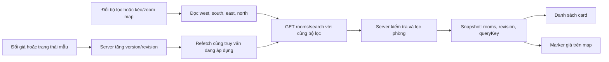

# Trang mẫu tìm phòng và đồng bộ map

## 1. Đã triển khai

- Next.js App Router tại `apps/web`, API trong cùng ứng dụng cho bản mẫu.
- Leaflet và bản đồ nền OpenStreetMap; không cần API key cho lớp tile mặc định.
- 18 phòng hư cấu, có mã, tọa độ, giá, diện tích, tiện ích, trạng thái và version.
- Lọc theo khu vực, giá tối đa, diện tích tối thiểu và đồng thời các tiện ích được chọn.
- Tìm theo tên phòng/đường/khu vực/mã, hỗ trợ tiếng Việt không dấu; sắp giá tăng/giảm.
- Kéo/zoom map tự truy vấn vùng nhìn thấy; card và marker chọn chung một room ID.
- Cùng một tập dữ liệu dựng danh sách và map, có loading/empty/error và nút cập nhật.
- Form thử đổi giá/trạng thái phòng, khôi phục seed, đồng bộ giữa hai tab; kiểm tra version chống ghi đè.
- Desktop chia list/map; mobile chuyển tab, chọn card mở chi tiết trên map.

## 2. Vì sao map và danh sách luôn phải dùng cùng nguồn?

Map nền chỉ vẽ đường/phường/khu vực. Các điểm phòng là một lớp riêng, lấy từ server TrueHome. Khi phòng đổi giá hoặc đã thuê, cần cập nhật lớp điểm phòng và card, không sửa dữ liệu OpenStreetMap.



Không lưu một bản `roomsForList` và một bản `roomsForMap` rồi sửa riêng. Component cha giữ `snapshot.data`; map và list đều nhận nó. Trong bản thật, hai endpoint list/map có thể tách để phân trang/cluster, nhưng phải dùng cùng điều kiện tìm kiếm và xử lý version nhất quán.

## 3. Khi kéo hoặc zoom map

Leaflet phát `moveend`; `getBounds()` trả bốn mép vùng nhìn thấy. Client chuẩn hóa các tọa độ, chờ 220 ms để gom thao tác liên tiếp, rồi gọi:

```text
GET /api/v1/rooms/search
  ?bbox=west,south,east,north
  &maxPrice=4000000
  &minArea=20
  &amenities=aircon,furnished
  &availableOnly=true
  &sort=price_asc
```

Server kiểm tra bbox đúng thứ tự và phạm vi, rồi áp dụng đồng thời tất cả điều kiện. Phòng nằm ngoài vùng nhìn thấy không có trong cả card và marker. Bộ lọc chọn trong giao diện được lưu vào URL; bản mẫu chưa lưu viewport trong URL, reload sẽ mở lại vùng mặc định.

`AbortController` hủy request cũ khi điều kiện đổi. Số thứ tự request tăng để response cũ đến muộn không ghi đè snapshot mới. `queryKey` giúp nhận biết kết quả vẫn thuộc truy vấn trước khi API chưa trả xong. API và fetch dùng `no-store` cho dữ liệu thay đổi.

## 4. Khi dữ liệu phòng thay đổi

Form **Thử đồng bộ** gửi giá/trạng thái và `version` hiện tại:

```text
PATCH /api/v1/demo/rooms/room-01
{ "version": 1, "price": 4000000, "status": "RENTED" }
```

Server chỉ cập nhật nếu version đúng, sau đó tăng version của phòng và revision của store. Version cũ nhận `409 VERSION_CONFLICT`; client tải dữ liệu mới và yêu cầu người dùng xem lại thay đổi. Form dùng dữ liệu mẫu, không phải API đặt phòng.

Tab thực hiện thay đổi refetch ngay. `BroadcastChannel` thông báo cho các tab cùng browser/origin refetch. Tab đang hiển thị còn polling mỗi 5 giây để nhận thay đổi từ client khác; khi tab được focus hoặc mạng trở lại cũng tải snapshot mới. Timer của browser có thể chậm hơn khi bị hạn chế; đây là đồng bộ gần thời gian thực, chưa phải WebSocket/SSE.

- Bật chỉ phòng còn trống: phòng đổi sang RENTED biến mất khỏi cả list/map.
- Tắt chỉ phòng còn trống: phòng vẫn xuất hiện với nhãn đã thuê và marker màu xám.
- Đổi giá vượt ngân sách hoặc thay trạng thái: kết quả tìm kiếm được tính lại trên server, không chỉ thay chữ ở card.
- `POST /api/v1/demo/reset` khôi phục seed và tăng revision để mọi tab biết dữ liệu đã đổi.
- Endpoint mutation kiểm tra Origin/Host và chỉ bật ở development hoặc khi người vận hành bật cờ demo rõ ràng.

## 5. Các file chính

| File | Vai trò |
|---|---|
| `apps/web/components/search-workspace.tsx` | Bộ lọc, fetch, chống response cũ, list, detail, polling, thử đồng bộ |
| `apps/web/components/room-map.tsx` | Tạo map, đọc bounds, cập nhật marker theo ID và responsive |
| `apps/web/lib/contracts.ts` | Kiểu dữ liệu, filter, serialize query dùng chung |
| `apps/web/lib/search.ts` | Validation và tìm kiếm phía server |
| `apps/web/lib/seed.ts` | Dataset phòng minh họa |
| `apps/web/lib/store.ts` | Store tạm, version, revision và reset |
| `apps/web/lib/same-origin.ts` | Kiểm tra nguồn request mutation demo |
| `apps/web/app/api/v1/rooms/search/route.ts` | Endpoint search snapshot |
| `apps/web/app/api/v1/demo/rooms/[id]/route.ts` | Thay đổi phòng mẫu có kiểm tra version |
| `apps/web/lib/search.test.ts` | Kiểm thử bbox/filter/từ khóa/version/origin |

## 6. Kiểm chứng bản mẫu

- Kiểm thử tự động: bbox trả đúng ID; kết hợp district/price/area/amenities; tìm không dấu; validation sai; sắp xếp ổn định; stale version bị từ chối; Origin khác bị từ chối.
- Kiểm tra browser: đến 4 triệu trả 9 card và 9 marker; thêm Quận 10 còn `room-11`, `room-13` ở cả hai nơi.
- Click marker `room-11` mở đúng mã TH-HCM-00011, card và marker cùng trạng thái chọn.
- Hai tab bắt đầu 18 phòng; đổi `room-01` sang RENTED, tab thứ hai còn 17 card/17 marker và không còn ID đó.
- Responsive phải giữ attribution map, không tràn ngang toàn trang; map bị ẩn ở list mobile không gửi bbox có kích thước bằng 0.

## 7. Khi thay dữ liệu mẫu bằng database

Store trong bộ nhớ chỉ phù hợp một tiến trình demo. Nhiều instance server có thể thấy store khác nhau; restart/hot reload có thể mất dữ liệu. Đây không phải nguồn dữ liệu bền vững.

Bước tiếp theo là thay repository của SearchService bằng PostgreSQL/PostGIS: bbox/spatial index, query có pagination/cluster và projection công khai. Giá/trạng thái phải lưu trong transaction; version cập nhật tại database. Thông báo qua outbox + SSE/WebSocket chỉ là tín hiệu refetch, database vẫn là nguồn chuẩn. Khi reconnect, tải snapshot để bù sự kiện bỏ lỡ. Booking/auth vẫn theo các checklist MVP riêng, chưa được thêm trong bản mẫu này.

## 8. Tài liệu nền và nguồn ảnh

- [Leaflet API: getBounds, moveend, markers](https://leafletjs.com/reference).
- [Next.js Route Handlers](https://nextjs.org/docs/app/api-reference/file-conventions/route).
- [OpenStreetMap tile usage policy](https://operations.osmfoundation.org/policies/tiles/): attribution hiển thị, dùng URL HTTPS, không prefetch/offline và giữ cache mặc định của browser. URL tile/attribution cấu hình trong `.env.example`; đổi provider phải đổi attribution tương ứng. Không có SLA cho tile mặc định.
- [Nguồn ảnh minh họa](apps/web/public/rooms/SOURCES.md). Ảnh dùng lặp cho dataset minh họa, không gắn với vị trí/phòng ngoài đời.
